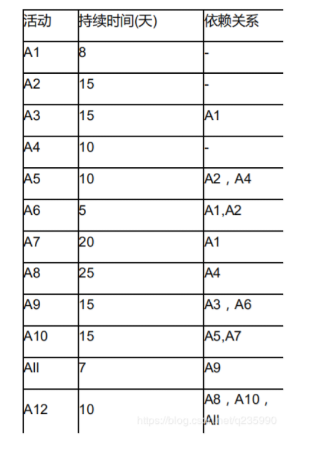

# soft-exam
准备参加2020中级软件工程师考试的参加，加油~~

## 相关学习链接
- 一个网站的题库 https://www.educity.cn/tiku/zt100110011003-1.html

## 专业词汇

- CPU
    - 访问存储器时，被访问一般具体在一小块连续存储，若被访问，临近可能被访问，特性叫空间局部性
- CPU的控制器
    - 一条指令功能实现需要若干操作信号配合完成
- CPU的运算器
    - 只能完成运算
- DMA：Direct Memory Access 直接内存存取，绕开CPU
    - 数据在主存和I/O（外设）之间直接成块传送
- DMA控制器
- Cache控制器
- 数据局部性
- 指令局部性
- 空间局部性
    - 访问存储单元，不久其附近存储单元也最可能被访问
- 时间局部性
    - 被执行过，将来可能会被执行
- 程序的局限性
    - 时间局部性
    - 空间局部性

- 千小时可靠度，单个可靠度R
    - 三个部件串联：R*R*R
    - 三个并联：1-(1-R)(1-R)(1-R)
    - 前两个并联后第三个串联（1-(1-R)^2）

- 模2运算
    - 只有循环冗余检验CRC
- 水平奇偶
- 垂直奇偶
- 海明码
- 循环冗余
    - 模2运算
- RISC 精简指令系统计算机
    - 指令长度固定、指令种类尽量少
  - 指令功能强大、寻址方式单一，多寄存器寻址
  - 增加寄存器数目以减少访问次数
  - 硬布线电路实现指令解码，快速指令译码
- 应用级网关
    - 它的防火墙内网外网的隔离点，可过滤和监控
 
- SSL 
    - 安全有关
- HTTPS
    - 安全有关
- MIME
    - 互联网标准，拓展电子邮件标准
- PGP：Pretty Good Privacy
- CA证书
- 私钥
- 公钥
- 数字证书
    - 对用户身份进行认证
    - 也就是发送方的数字签名
- 数字签名
    - 确保消息不可否认
    - 也就是公钥
- 消息加密
- 用户私钥
- 震网（Stuxnet）病毒
    - 破坏工业基础设置的恶意代码
    - 蠕虫病毒
    - 2010年6月被发现，攻击电网、核电站、水坝
- 引导区病毒
    - 破坏引导盘、文件目录等
- 宏病毒
    - 破坏Office文件先关
- 木马病毒
    - 强调控制操作
- 蠕虫病毒
- 著作权
    - 软件开发完成之时就有了著作权
- 数据流图建模
   - 遵从 自顶向下，抽象到具体的原则
    - 结构化分析工具
- 结构化基本成分模块
    - 模块
    - 调用
    - 控制
    - 转接符号
    - 数据（次要）
- 沟通路径
    - 10个开发，任意两个存在沟通路径(1+....+9 )=45
    - 无主程序公式(m-1)/2=45
- 完成存在并行+依赖关系的工作时间计算，最大值作为开始+需要完成的天数=最终天数

- 软件项目风险
    - 成员离职
    - 缺乏专业培训
    - 找不到符合项目技术要求
- 通用程序设计的语言成分
    - 数据
    - 运算
    - 控制
        - 顺序
        - 选择
        - 循环
    - 传输

- 词法分析阶段
    - 词法规则
    - 逐个字符扫描
    - 词汇检查
- 语法分析
    - 词法基础上分解为语法单位
    - 如何表达式、语句、程序
- 语法规则
    - 语法单位构成规则
    - 针对结构检查
- 语义分析阶段
    - 检查是否包含语义错误
    - 句子检查
- 高级源码需要收集符合、特征
    - 并存入符号表
- 哈希表
- 堆栈
- 队列
- 先来先服务调度算法
- bitmap记录磁盘、资产64位、磁盘1024GB、物理大小4MB
    - 字长64位，需要64个物理块
    - 存在多少个物理块？1024G/4MB=256*1024个物理块，这跟下面有什么关系？
    - 每64个物理块占用一个字，所需256*1014/64=4096个字
- pv 操作
    - 实现资源互斥作用
    - 利用信号量机制
    - 有效进程同步与互斥工具
- 嵌入性操作系统特点
    - 微型，减少资源和代码量少
    - 可定制，减少成本
    - 实时性
    - 可靠性
    - 易移植性
- 系统原型
    - 帮助导出系统需求并验证需求有效性
    - 探索特殊软件解决方案
    - 支持用户界面设计
- 极限编程（XP）
    - 处理当前，设计简单
    - 写完之后写测试代码
    - 用户配合XP团队
    - 提测小型版本发布，迭代周期2周
- ISO/IEC126软件质量模型
    - 功能性包含质量子特性安全性
    - 适合性
    - 准确性
    - 互用性
    - 依从性
    - 安全性

- 模块A给模块B传递数据结果x，这两个模块耦合类型
    - 标记耦合

- 数据耦合
    - 通过简单数据参数交换输入输出信息
- 公共耦合
    - 都访问一共公共数据环境
    - 公共数据环境可以是
        - 全局数据结构
        - 共享通信区
        - 内存
- 外部耦合
    - 都访问全局简单变量而不是全局数据结构
    - 不能通过参数表传递该全局变量的信息
- 标记耦合
    - 参数表传递记录信息
    - 记录是某数据结构的子结构
- Theo Mandel 黄金原则
    - 用户控制
    - 减少记忆负担
    - 界面一致性