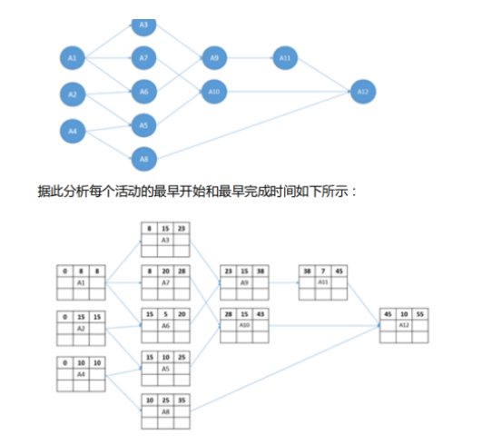

# soft-exam
准备参加2020中级软件工程师考试的参加，加油~~

## 相关学习链接
- 一个网站的题库 https://www.educity.cn/tiku/zt100110011003-1.html
- pdf文件改天再传吧

## 专业词汇

- CPU
    - 访问存储器时，被访问一般具体在一小块连续存储，若被访问，临近可能被访问，特性叫空间局部性
- CPU的控制器
    - 一条指令功能实现需要若干操作信号配合完成
- CPU的运算器
    - 只能完成运算
- DMA：Direct Memory Access 直接内存存取，绕开CPU
    - 数据在主存和I/O（外设）之间直接成块传送
- DMA控制器
- Cache控制器
- 数据局部性
- 指令局部性
- 空间局部性
    - 访问存储单元，不久其附近存储单元也最可能被访问
- 时间局部性
    - 被执行过，将来可能会被执行
- 程序的局限性
    - 时间局部性
    - 空间局部性

- 千小时可靠度，单个可靠度R
    - 三个部件串联：R*R*R
    - 三个并联：1-(1-R)(1-R)(1-R)
    - 前两个并联后第三个串联（1-(1-R)^2）

- 模2运算
    - 只有循环冗余检验CRC
- 水平奇偶
- 垂直奇偶
- 海明码
- 循环冗余
    - 模2运算
- RISC 精简指令系统计算机
    - 指令长度固定、指令种类尽量少
  - 指令功能强大、寻址方式单一，多寄存器寻址
  - 增加寄存器数目以减少访问次数
  - 硬布线电路实现指令解码，快速指令译码
- 应用级网关
    - 它的防火墙内网外网的隔离点，可过滤和监控
 
- SSL 
    - 安全有关
- HTTPS
    - 安全有关
- MIME
    - 互联网标准，拓展电子邮件标准
- PGP：Pretty Good Privacy
- CA证书
- 私钥
- 公钥
- 数字证书
    - 对用户身份进行认证
    - 也就是发送方的数字签名
- 数字签名
    - 确保消息不可否认
    - 也就是公钥
- 消息加密
- 用户私钥
- 震网（Stuxnet）病毒
    - 破坏工业基础设置的恶意代码
    - 蠕虫病毒
    - 2010年6月被发现，攻击电网、核电站、水坝
- 引导区病毒
    - 破坏引导盘、文件目录等
- 宏病毒
    - 破坏Office文件先关
- 木马病毒
    - 强调控制操作
- 蠕虫病毒
- 著作权
    - 软件开发完成之时就有了著作权
- 数据流图建模
   - 遵从 自顶向下，抽象到具体的原则
    - 结构化分析工具
- 结构化基本成分模块
    - 模块
    - 调用
    - 控制
    - 转接符号
    - 数据（次要）
- 沟通路径
    - 10个开发，任意两个存在沟通路径(1+....+9 )=45
    - 无主程序公式(m-1)/2=45
- 完成存在并行+依赖关系的工作时间计算，最大值作为开始+需要完成的天数=最终天数




- 软件项目风险
    - 成员离职
    - 缺乏专业培训
    - 找不到符合项目技术要求
- 通用程序设计的语言成分
    - 数据
    - 运算
    - 控制
        - 顺序
        - 选择
        - 循环
    - 传输

- 词法分析阶段
    - 词法规则
    - 逐个字符扫描
    - 词汇检查
- 语法分析
    - 词法基础上分解为语法单位
    - 如何表达式、语句、程序
- 语法规则
    - 语法单位构成规则
    - 针对结构检查
- 语义分析阶段
    - 检查是否包含语义错误
    - 句子检查
- 高级源码需要收集符合、特征
    - 并存入符号表
- 哈希表
- 堆栈
- 队列
- 先来先服务调度算法
- bitmap记录磁盘、资产64位、磁盘1024GB、物理大小4MB
    - 字长64位，需要64个物理块
    - 存在多少个物理块？1024G/4MB=256*1024个物理块，这跟下面有什么关系？
    - 每64个物理块占用一个字，所需256*1014/64=4096个字
- pv 操作
    - 实现资源互斥作用
    - 利用信号量机制
    - 有效进程同步与互斥工具
- 嵌入性操作系统特点
    - 微型，减少资源和代码量少
    - 可定制，减少成本
    - 实时性
    - 可靠性
    - 易移植性
- 系统原型
    - 帮助导出系统需求并验证需求有效性
    - 探索特殊软件解决方案
    - 支持用户界面设计
- 极限编程（XP）
    - 处理当前，设计简单
    - 写完之后写测试代码
    - 用户配合XP团队
    - 提测小型版本发布，迭代周期2周
- ISO/IEC126软件质量模型
    - 功能性包含质量子特性安全性
    - 适合性
    - 准确性
    - 互用性
    - 依从性
    - 安全性

- 模块A给模块B传递数据结果x，这两个模块耦合类型
    - 标记耦合

- 数据耦合
    - 通过简单数据参数交换输入输出信息
- 公共耦合
    - 都访问一共公共数据环境
    - 公共数据环境可以是
        - 全局数据结构
        - 共享通信区
        - 内存
- 外部耦合
    - 都访问全局简单变量而不是全局数据结构
    - 不能通过参数表传递该全局变量的信息
- 标记耦合
    - 参数表传递记录信息
    - 记录是某数据结构的子结构
- Theo Mandel 黄金原则
    - 用户控制
    - 减少记忆负担
    - 界面一致性
- CPU：运算器、控制器等
    - 可完成：算术、逻辑运算、控制

## 计算机系统

### 计算机系统
- 计算机组成
    - 硬件（5大部分）
        - 组成：
            - 运算器
            - 控制器
            - 存储器
                - 外部存储器:速度快、容量小
                    - 临时存储、数据、中间结果
                - 内部存储器：速度慢，容量大
                    - 长期存储
            - 输入设备：键盘、鼠标等
            - 输出设备：显示器等
        - 核心：CPU

    - 软件

- CUP 功能：
    - 程序控制
    - 操作控制
    - 时间控制
    - 数据处理

- CPU 功能组成


- 运算器：
    - 组成：
        - 算术逻辑单元Atrithmetic and Logic Unit, ALU
        - 累加寄存器
        - 数据缓冲寄存器
        - 状态条件寄存器
    - 受控制器的命令而进行动作
    - 本身是执行部件
    - 执行所有算术运算：加减乘除等
    - 至少有一个累加寄存器
- 算术逻辑单元(ALU)
- 累加寄存器(AC)
- 数据缓冲寄存器(AR)
- 状态条件寄存器(PSW)
    - 组成
        - 状态标志
        - 控制标志
        - 进位标志：C
        - 溢出标志：V
        - 为0标志：Z
        - 未负标志：N
        - 中断标记：I
        - 方向标志：D
        - 单步标志
    - 标志位由1位触发器保存，保存当前指令执行完成之后的状态
    - 一个算术操作产生一个运算结果
    - 一个逻辑操作产生一个判决
- 控制器
    - 组成：
        - 指令控制逻辑
            - 操作：取指令、分析指令、执行指令
            - 过程：取指令、指令译码、按指令操作码执行、形成下 一指令地址
        - 时序控制逻辑
            - 指令寄存器(IR)
                - CPU执行指令：从内存储器取到缓冲寄存器再送指令寄存器(IR)，ID跟IR产品微操指令
            - 程序计数器(PC)
                - 功能：寄存、计数；也叫指令计数器
                - 执行情况：顺序执行（多数情况）、转移执行
            - 地址寄存器(AR)
                - 保存CPU所访问的内存单元的地址
                - 因操作速度差异而需要使用到AR保存地址信息
            - 指令译码器(ID)
                - 包含操作码、地址码
        - 总线控制逻辑
        - 中断控制逻辑
- 寄存器组
    - 分为：专用寄存器、通用寄存器
    - 运算器和控制器的寄存器都是专用寄存器
- 多核CPU
    - 核心称为内核，单芯片上集成多个处理器内核
    - 一级缓存：2k到几十k，先被访问
    - 二级缓存：较高容量，缓存足够高的命中率
    - 执行单元
    - 指令级单元
    - 总线接口
    - 每核都有：逻辑单元、控制单元、中断处理器、运算单元、一级Cache、二级Cache共享或独有
- 双核：AMD，刷新BIOS即可
- 双芯：Intel
    - 超线程技术，4核可以视为8核，但低于实际8核

- 机器数：
    - 无符号数：正数
    - 带符号：最高位正、负符号位
    - 为了方便运算带符号可采用原码、反码、补码等不同的编码方法
    - 机器数的这些编码方法称为码制
- 原码
    - 题目：弱机器字长n等于8，分别给出+1,-1,+127,-127,+45,-45,+0.5,-0.5的源码表示
    
    - 最高位是符号位，
    - 0表示正位
    - 1表示负位
    - 其余n-1表示数值的绝对值
    - 数值0的原码表示有两种：[+0]<sub>原</sub>=0 0000000，[-0]<sub>原</sub>=1 0000000
    - 原码小数点应该什么表示：
    - [+20]<sub>原</sub>= 0 00101000，需要说明的是，它是几个字节长等于多少,
    - [+0.5]<sub>原</sub>= 0 1000000 小数点后.5 x2 = 1大于等于1，小于10，从组边开始排过去
    - [-0.5]<sub>原</sub>= 1 1000000
    - 并且从后面过去，右边到左边
    - 一次演算原码
        ```txt
        数字=34.375
        先算整数位:
        34/2=17余0
        17/2=8余1
        8/2=4余0
        4/2=2余0
        2/2=1余0
        整数部分100010
        分数
        .375X2=.75，<1，此位为0
        .75X2=1.5，>1，此位为1，剩.5
        .5X2=1，=1，此位为1
        小数部分就是：.011
        结果100010.011
        ```
- 反码表示法
    - [X]<sub>反</sub>
    - 负数的反码是整数的反码
    - 正号 0
    - 负号 1
    - [+1]<sub>反</sub>=0 0000001
    - [-1]<sub>反</sub>=1 1111110
    - [+127]<sub>反</sub>=0 1111111
    - [-127]<sub>反</sub>=1 0000000
    - [+45]<sub>反</sub>= 1 0101101
    - [-45]<sub>反</sub>= 0 1010010
    - [+0.5]<sub>反</sub>= 0♢ 1000000
    - [-0.5]<sub>反</sub>= 1♢ 0111111
- 补码表示法
    - [X]<sub>补</sub>
    - 正号 0
    - 负号 1
    - 负数的补码则末尾+1
    - 正数与原码反码相同
    - 补码0有唯一编码
    - [+0]<sub>补</sub>=   0 0000000
    - [-0]<sub>补</sub>=   0 0000000
    - [+1]<sub>补</sub>=   0 0000001
    - [-1]<sub>补</sub>=   1 1111111
    - [+127]<sub>补</sub>= 0 1111111
    - [-127]<sub>补</sub>= 1 0000001
    - [+45]<sub>补</sub>=  0 0101101
    - [-45]<sub>补</sub>=  1 1010011
    - todo 小数点这里的公式不对了??
    - [+0.5]<sub>补</sub>= 0♢1000000
    - [-0.5]<sub>补</sub>= 1♢1000000
- 移码表示法
    - 机器字长n，规定偏移量2<sup>n-1</sup>
    - 常用语浮点数中的阶码
    - X 纯整数，则[X]<sub>移</sub> = 2<sup>n-1</sup>+X(-2<sup>n-1</sup> ≤ X ≤ 2<sup>n-1</sup>)
    - X 纯小数，则 [X]<sub>移</sub> = 1+X(-1≤X≤1)
    - 移码是补码的符号位取反
    - [+0]<sub>移</sub>=    0 0000000 => 1 0000000
    - [-0]<sub>移</sub>=    0 0000000 => 1 0000000
    - [+1]<sub>移</sub>=    0 0000001 => 1 0000001
    - [-1]<sub>移</sub>=    1 1111111 => 0 1111111
    - [+127]<sub>移</sub>=  0 1111111 => 1 1111111
    - [-127]<sub>移</sub>=  1 0000001 => 0 0000001
    - [+45]<sub>移</sub>=   0 0101101 => 1 0101101
    - [-45]<sub>移</sub>=   1 1010011 => 0 1010011
    - todo 后续这个表达方法
    - [+0.5]<sub>移</sub>= 
    - [-0.5]<sub>移</sub>=  

- 机器字长为0时各种码制表示的带符号数范围todo

| 码制 | 定点整数 | 定点小数 |
| 原码||| 
| 反码||| 
| 补码||| 
| 移码||| 

- 奇偶校验码 Parity Codes
- 海明码 Hamming Code
- 循环冗余校验码 Cyclic Redundancy Check

### 存储系统

          / CPU内部通用寄存器 \
         /        Cache       \
        /       主存储器        \
       /       联机磁盘存储器     \
      /      脱机光盘、磁盘存储器   \

- 内存：主存
- 外存：辅存，磁盘，磁带，光盘
- 可编程只读存储器，厂家一次性写入，写入后不可再更改
- 替换算法
    - 随机替换算法：随机发生器产生一个替换的块号，将该块替换出去
    - 先进先出算法：最先进入Cache的信息块替换出去
    - 近期最少使用算法：最近少用的Cache中的信息块替换出去
    - 优化替换算法。必须先执行一次程序，统计Cache替换情况，并为第二次提供参考信息来替换
### 中断
    - 中断信号线法
    - 中断软件查询法
    - 菊花链法
    - 总线仲裁法
    - 中断向量表法
### 总线
    - 数据总线
    - 地址总线Address Bus，AB
        - 单向，决定CPU最大寻址能力
    - 控制总线
        - 传送控制信号
        - 时序信号
        - 状态信息
    - ISA总线
    - EISA 总线
    - PCI总线
    - PCI Express 总线：PCI-E
    - 前端总线
    - RS-232C
    - SCSI总线
    - SATA
    - USB
    - IEEE-1394
    - IEEE-488总线

### 计算机安全
    - 美国国防部与国家标准局《可信计算机系统评估准则》 TCSEC
    - 加拿大《可信计算机产品评估准则》 CTCPEC
    - 美国《联邦(最低安全要求)评估准则》 FC
    - 欧盟 《信息技术安全评估准则》 ITSEC
    - 美国《信息技术安全通用评估准则》CC标准，ISO为国际标准

 典型安全威胁
|威胁|说明|
|---|---|
|授权侵犯||
|拒绝服务||
|窃听||
|信息泄露||
|截获/修改||
|假冒||
|否认||
|非法使用||
|人员疏忽||
|完整性破坏||